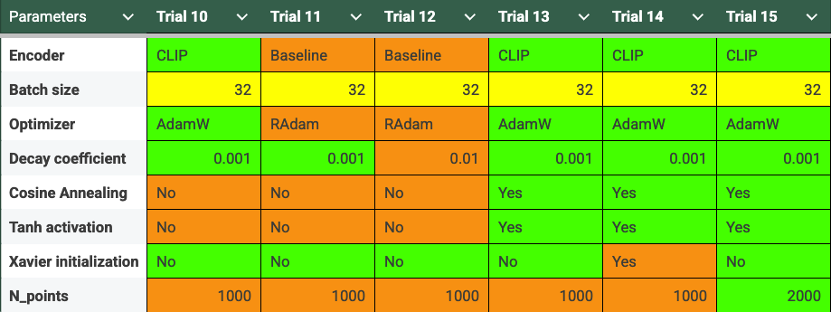

# 3D Shape Reconstruction from Single Images

3D shape reconstruction addresses the inverse graphics problem: given a single 2D image of an object, predict its complete 3D geometry including occluded surfaces. This requires the model to learn strong shape priors and geometric reasoning - understanding that a chair viewed from the front likely has four legs, even when only two are visible. I implemented and compared three 3D output representations (voxels, point clouds, meshes) using the ShapeNet dataset, with systematic evaluation of different encoder architectures and training approaches.

## What It Does

Takes a single image → outputs a 3D reconstruction in your choice of:
- **Voxels**: 32³ occupancy grids
- **Point clouds**: 1000-2000 surface points
- **Meshes**: Deformed icosphere topology

Tested ResNet18, CLIP, and DINO encoders. CLIP won consistently.

## Technical Implementation

### Loss Functions

Each 3D representation requires different loss designs:

**Voxels**: Binary cross-entropy with probability clamping (0-1 range) to prevent gradient explosion.

**Point Clouds**: Custom chamfer loss implementation - bidirectional nearest neighbor distances:
```python
def chamfer_loss(point_cloud_src, point_cloud_tgt):
    dists1_2 = knn_points(p1=point_cloud_src, p2=point_cloud_tgt, K=1).dists[...,0]
    dists2_1 = knn_points(p1=point_cloud_tgt, p2=point_cloud_src, K=1).dists[...,0]
    loss = torch.mean(torch.sum(dists1_2, dim=1) + torch.sum(dists2_1, dim=1))
    return loss
```

**Meshes**: Laplacian smoothing regularization to maintain surface quality.

### Decoder Architectures

**Voxel**: 3D transposed convolutions (512D → 32³ grid) with batch normalization
**Point Cloud**: Fully connected layers (512 → 1024 → 2048 → N×3) with tanh activation  
**Mesh**: Vertex displacement prediction from icosphere initialization

## Results

### Hyperparameter Analysis

Systematic evaluation across encoder architectures and hyperparameters:



**Key findings:**
- CLIP encoder outperformed ResNet18 across configurations
- AdamW optimizer showed better convergence than RAdam  
- Point cloud quality improved with 2000 vs 1000 points
- Cosine annealing + tanh activation provided marginal gains

### Sample Reconstructions

Input images (PNG) and their corresponding 3D reconstructions (GIF):

**Example 1:**
Input:  → Output: 

**Example 2:**  
Input:  → Output: 

**Example 3:**
Input:  → Output: 

**Example 4:**
Input:  → Output: 

Models achieve reasonable reconstructions but struggle with fine details and occlusion handling.

## Analysis

**CLIP advantage**: Vision-language pretraining appears to provide better geometric priors than pure visual features.

**Representation trade-offs**: 
- Voxels: Complete occupancy but memory-intensive
- Point clouds: Efficient but lose surface connectivity  
- Meshes: Preserve topology but require good initialization

**Training stability**: 3D convolutions sensitive to architectural changes.

## Usage

```bash
python train_model.py --type [vox|point|mesh] --arch clip
python eval_model.py --type [vox|point|mesh] --load_checkpoint
```

**Dependencies**: PyTorch, PyTorch3D, CLIP

**Code structure**: `model.py` (architectures), `losses.py` (loss functions), `train_model.py` (training), `eval_model.py` (evaluation)